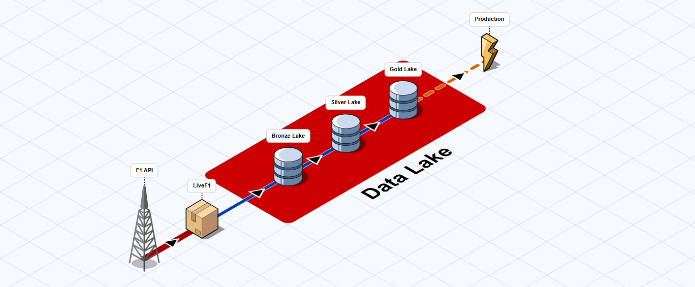

.. _medallion_architecture:
Data Lake Architecture
======================

LiveF1 implements a three-layer data processing architecture known as the `Medallion Architecture <https://www.databricks.com/glossary/medallion-architecture>`_ . This design pattern organizes data into Bronze (raw), Silver (cleaned), and Gold (analytics-ready) layers, ensuring data quality and efficient processing.

.. grid:: 3
   :gutter: 2
   :class-container: sd-text-center

   .. grid-item-card:: Bronze Layer
      :img-top: ../_static/bronze.png
      :class-card: sd-border-0

      Raw data ingestion
      Raw logs and records
      Single source of truth

   .. grid-item-card:: Silver Layer  
      :img-top: ../_static/silver.png
      :class-card: sd-border-0

      Cleaned & enriched data
      Standardized formats
      Quality assured

   .. grid-item-card:: Gold Layer
      :img-top: ../_static/gold.png 
      :class-card: sd-border-0

      Analytics-ready data
      Optimized queries
      Business metrics

Layer Details
------------

Bronze Layer (Raw Data)
^^^^^^^^^^^^^^^^^^^^^^

The Bronze layer stores the data coming from official F1 API or other sources in its original format, serving as the foundation of our data lake. Generally; more complex, refined, or useful data tables are sourced from Bronze Lake.

The coming data is parsed by predefined parsing functions in LiveF1. It is good to keep in mind that, topic names sometimes differ from one session to another. In that case, some topic names may not be covered. Please open an issue for that cases, or you can implement and contribute.

.. code-block:: python
   :caption: Example: Loading Raw Data
   :emphasize-lines: 4

    # Get raw timing data
    session = livef1.get_session(2024, "Spa", "Race")
    
    raw_data = session.get_data("TimingData")  # Loads data and puts to Bronza Lake
    print(raw_data.head())

Silver Layer (Refined Data) 
^^^^^^^^^^^^^^^^^^^^^^^^^

The Silver layer contains cleaned, validated, and enriched data ready for analysis.

The Silver layer and Gold layer needs to be fed from other tables to be generated. Tables can be sourced from the tables in same level or lower level. The default tables are already registered with their processing functions, see `Default Silver and Gold Tables`_.

.. code-block:: python
   :caption: Example: Generating Registered Silver Tables
   :emphasize-lines: 4,7

    # Generate silver layer tables
    session = livef1.get_session(2024, "Spa", "Race")
    
    session.generate(silver=True)  # Process Silver Tables
    
    # Access refined data
    laps_data = session.laps # Get from Silver lake
    print(laps_data.head())

Gold Layer (Analytics Ready)
^^^^^^^^^^^^^^^^^^^^^^^^

The Gold layer provides optimized, aggregated data ready for business intelligence and machine learning.

.. code-block:: python
   :caption: Example: Accessing Gold Layer Data
   :emphasize-lines: 12

      import livef1

      session = livef1.get_session(
         2024,
         "Belgian",
         "Qualifying"
      )

      ## ...Register gold tables here...

      # Generate all tables
      session.generate(gold=True) # We should set gold as True.

.. _registering_custom_tables:

Registering Custom Tables
-------------------------

Register Silver Table
*********************

In the previous examples, LiveF1 generates the silver tables that are already registered as defauls such as laps, carTelemetry etc. But what is the registered tables? Registered tables are the tables where their ETL function is already been set. There are some default ones that is registered inside LiveF1, and also new tables can be registered as well. So how to register new tables?

.. code-block:: python
   :caption: Example: Registering Custom Silver Tables
   :emphasize-lines: 6

   import livef1
   
   # Generate silver layer tables
   session = livef1.get_session(2025, "British", "Race")

   @session.create_silver_table(
      table_name = "RaceLeaders",
      source_tables = ["Timing_Data"],
      include_session = True
   )
   def race_leaders(
      session, # Since include session is True, session should be added as parameter
      Timing_Data # Source tables with the original name should be added as parameters
      ):
      tmg_df = Timing_Data
      tmg_df["DriverName"] = [session.get_driver(driver_no).FullName for driver_no in tmg_df["DriverNo"]]
      tmg_df[tmg_df["Position"] == "1"][["DriverName", "DriverNo","GapToLeader", "Position"]].reset_index(drop=True)
      
      return tmg_df

   session.generate() # Generate registered Silver lake
   print(session.RaceLeaders)

.. code-block:: cli

   ...
   ...
   11:57:07 - The callback function for the SILVER table 'RaceLeaders' was set. # Your silver table function was registered.
   11:57:07 - The callback function for the SILVER table 'laps' was set.
   11:57:07 - The callback function for the SILVER table 'carTelemetry' was set.
   11:57:07 - Topics to be loaded : ['TimingData', 'TrackStatus', 'Position.z', 'TyreStintSeries', 'Timing_Data', 'RaceControlMessages', 'SessionStatus', 'track_regions', 'CarData.z'] # You should see the source tables you use in that list.
   ...
   ...
   11:57:23 - Silver tables are being generated.
   11:57:24 - 'RaceLeaders' has been generated and saved to the silver lake. You can access it from 'session.RaceLeaders'.
   11:57:29 - 'laps' has been generated and saved to the silver lake. You can access it from 'session.laps'.
   11:57:53 - 'carTelemetry' has been generated and saved to the silver lake. You can access it from 'session.carTelemetry'.
   ...
   ...

   |    | DriverName      |   DriverNo | GapToLeader   |   Position |
   |---:|:----------------|-----------:|:--------------|-----------:|
   |  0 | Charles LECLERC |         16 |               |          1 |
   |  1 | Lewis HAMILTON  |         44 | LAP 3         |          1 |
   |  2 | Charles LECLERC |         16 | LAP 11        |          1 |
   |  3 | Carlos SAINZ    |         55 | LAP 13        |          1 |
   |  4 | Lewis HAMILTON  |         44 | LAP 20        |          1 |
   |  5 | Oscar PIASTRI   |         81 | LAP 27        |          1 |
   |  6 | George RUSSELL  |         63 | LAP 31        |          1 |

Register Silver and Gold Tables together
****************************************

Now, lets create multiple tables that source from each other.

.. code-block:: python
   :caption: Example: Registering Silver and Gold Tables together

   import livef1

   session = livef1.get_session(
      2024,
      "Belgian",
      "Qualifying"
   )

   @session.create_silver_table(
      table_name = "SectorDiff",
      source_tables = ["laps"], # This time we source from a default silver table to create a silver table.
      include_session = True
   )
   def sector_diff(session, laps):
      df = laps.groupby("DriverNo")[["Sector1_Time","Sector2_Time","Sector3_Time"]].min().reset_index()
      df["sector1_diff"] = (df["Sector1_Time"] - df["Sector1_Time"].min()).dt.total_seconds()
      df["sector2_diff"] = (df["Sector2_Time"] - df["Sector2_Time"].min()).dt.total_seconds()
      df["sector3_diff"] = (df["Sector3_Time"] - df["Sector3_Time"].min()).dt.total_seconds()
      df["DriverName"] = df["DriverNo"].map(lambda x: session.drivers[x].FullName)
      return df

   @session.create_gold_table(
      table_name = "SectorLeaders",
      source_tables = ["SectorDiff"], # This time we source from a newly registered silver table to create a gold table.
      include_session = True
   )
   def sector_diff(session, SectorDiff):
      return SectorDiff.iloc[SectorDiff[["sector1_diff","sector2_diff","sector3_diff"]].idxmin().values]

   # Generate all tables
   session.generate(silver=True, gold=True) # We should set gold as True.

.. code-block:: python

   print(session.SectorDiff.head())
   # |    |   DriverNo | Sector1_Time           | Sector2_Time           | Sector3_Time           |   sector1_diff |   sector2_diff |   sector3_diff | DriverName      |
   # |---:|-----------:|:-----------------------|:-----------------------|:-----------------------|---------------:|---------------:|---------------:|:----------------|
   # |  0 |          1 | 0 days 00:00:31.941000 | 0 days 00:00:50.837000 | 0 days 00:00:30.321000 |          0.05  |          0     |          0.131 | Max VERSTAPPEN  |
   # |  1 |         10 | 0 days 00:00:32.278000 | 0 days 00:00:51.707000 | 0 days 00:00:30.465000 |          0.387 |          0.87  |          0.275 | Pierre GASLY    |
   # |  2 |         11 | 0 days 00:00:32.216000 | 0 days 00:00:51.068000 | 0 days 00:00:30.423000 |          0.325 |          0.231 |          0.233 | Sergio PEREZ    |
   # |  3 |         14 | 0 days 00:00:32.191000 | 0 days 00:00:51.425000 | 0 days 00:00:30.543000 |          0.3   |          0.588 |          0.353 | Fernando ALONSO |
   # |  4 |         16 | 0 days 00:00:32.040000 | 0 days 00:00:51.176000 | 0 days 00:00:30.428000 |          0.149 |          0.339 |          0.238 | Charles LECLERC |
   
   print(session.SectorLeaders.head())
   # |    |   DriverNo | Sector1_Time           | Sector2_Time           | Sector3_Time           |   sector1_diff |   sector2_diff |   sector3_diff | DriverName     |
   # |---:|-----------:|:-----------------------|:-----------------------|:-----------------------|---------------:|---------------:|---------------:|:---------------|
   # | 13 |         31 | 0 days 00:00:31.891000 | 0 days 00:00:51.947000 | 0 days 00:00:30.437000 |          0     |           1.11 |          0.247 | Esteban OCON   |
   # |  0 |          1 | 0 days 00:00:31.941000 | 0 days 00:00:50.837000 | 0 days 00:00:30.321000 |          0.05  |           0    |          0.131 | Max VERSTAPPEN |
   # | 19 |         81 | 0 days 00:00:32.104000 | 0 days 00:00:51.417000 | 0 days 00:00:30.190000 |          0.213 |           0.58 |          0     | Oscar PIASTRI  |

Processing Methods
^^^^^^^^^^^^^^^^^^^

LiveF1 provides methods for processing data through each layer:

.. list-table::
   :header-rows: 1
   :widths: 30 70

   * - Method
     - Description
   * - ``load_data()``
     - Loads raw data into Bronze layer
   * - ``get_data()``
     - Gets loaded data if loaded, if not executes ``load_data()`` first.
   * - ``generate(silver=True)``
     - Processes Silver tables
   * - ``generate(gold=True)``
     - Processes Gold tables

.. _default_tables:

Default Silver and Gold Tables
^^^^^^^^^^^^^^^^^^^^^^^^^^^^^^

.. list-table::
   :header-rows: 1
   :widths: 20 20 60 

   * - Level
     - Name
     - Description
   * - ``Silver``
     - laps
     - Lap by lap information for each driver.
   * - ``Silver``
     - carTelemetry
     - Telemetry data with car and position telemetry and additional track informations.

.. Best Practices
.. -------------

.. When working with the Medallion Architecture in LiveF1:

.. 1. **Data Loading**
..    - Always load raw data to Bronze first
..    - Use parallel loading for multiple feeds
..    - Implement error handling

.. 2. **Data Processing**
..    - Generate Silver tables as needed
..    - Cache frequently used data
..    - Monitor processing time

.. 3. **Data Access**
..    - Use appropriate layer for needs
..    - Implement data validation
..    - Follow access patterns

.. seealso::
   - :ref:`data_topics` for available data feeds
   - :ref:`api_reference` for detailed API documentation

.. Next Steps
.. ---------

.. - Learn about :ref:`data_objects` in LiveF1
.. - Explore :ref:`examples` for practical usage
.. - Read about :ref:`quick_start` for getting started

.. Data Flow Architecture
.. ---------------------

.. .. code-block:: text
..    :caption: Data Flow Diagram
..    :class: no-copybutton

..     Raw Data Sources                    Processing Layers                   Consumption
..     ┌──────────────┐     ┌────────────┐     ┌────────────┐     ┌────────────┐     ┌──────────────┐
..     │   F1 Live    │     │            │     │            │     │            │     │  Analytics   │
..     │   Timing    ─┼────►│   Bronze   │────►│   Silver   │────►│    Gold    │────►│  Dashboards  │
..     │              │     │    Lake    │     │    Lake    │     │    Lake    │     │              │
..     └──────────────┘     └────────────┘     └────────────┘     └────────────┘     └──────────────┘
..                                │                  │                   │
..                                ▼                  ▼                   ▼
..                             Raw Storage      Cleaned Data        Aggregated
..                             JSON Files       Pandas Tables      Analytics Data